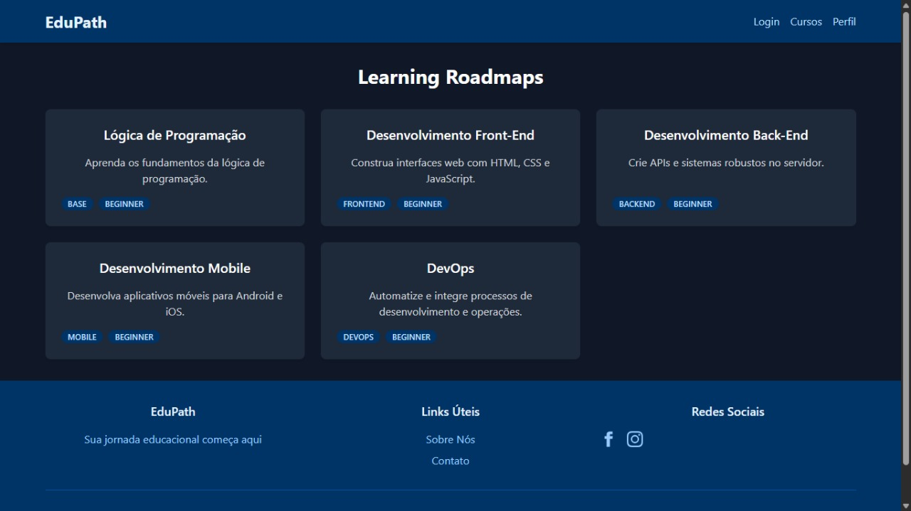
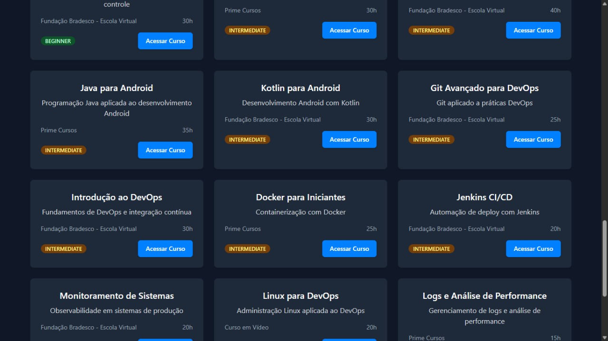
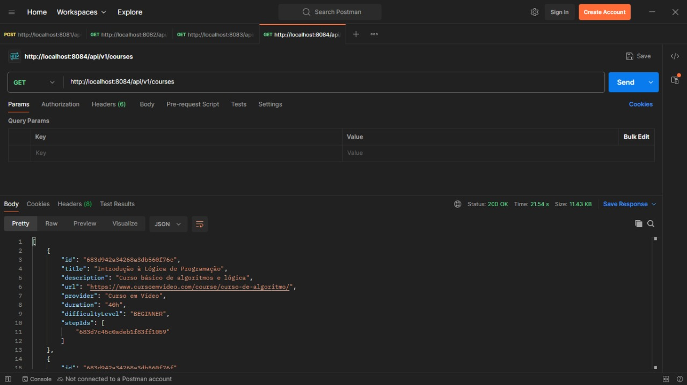
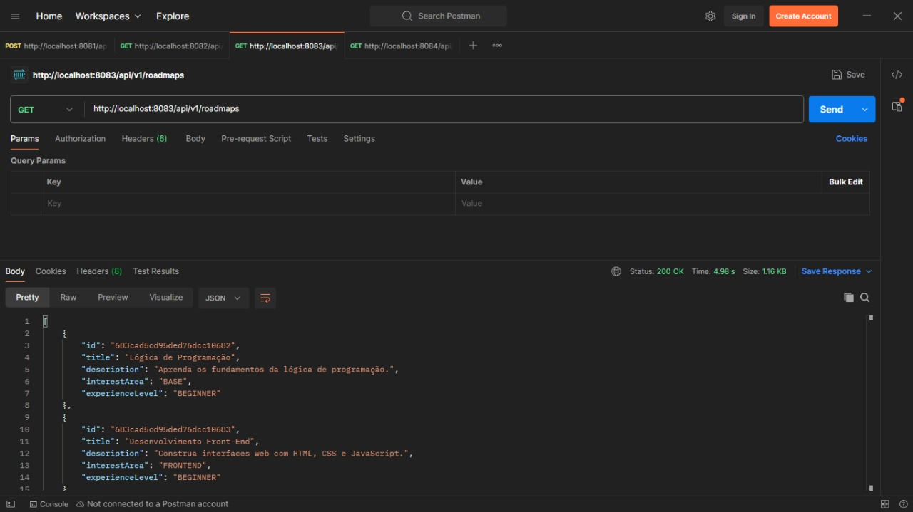
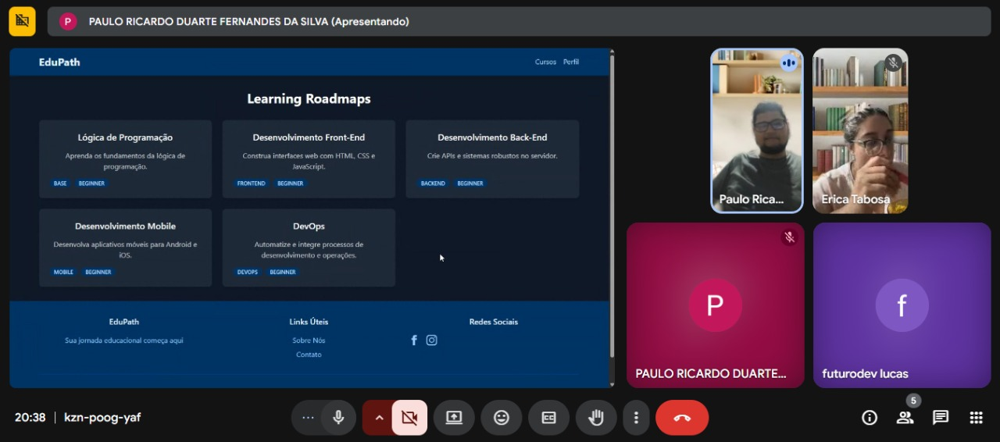
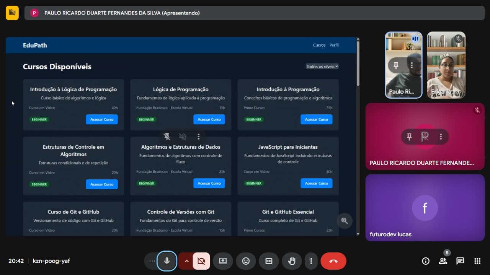
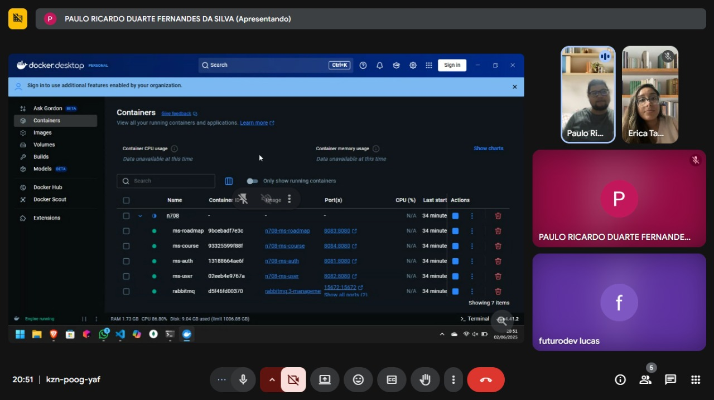
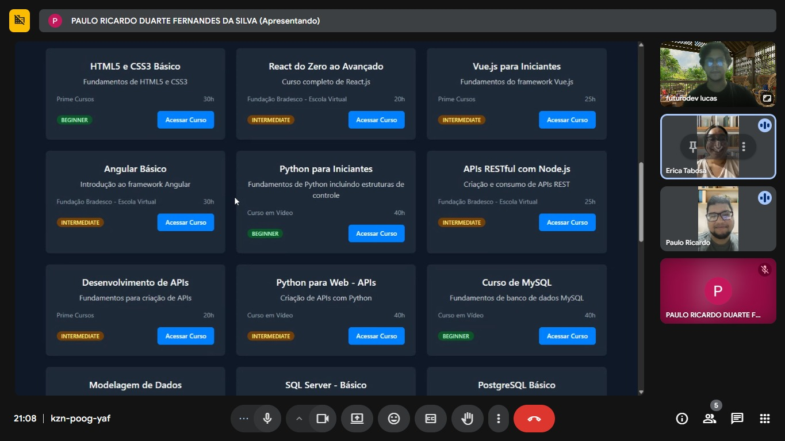

# EduPath - Plataforma de Trilhas de Aprendizado

## Sumário

1. [Visão Geral](#visão-geral)
2. [Objetivos do Projeto](#objetivos-do-projeto)
3. [Arquitetura](#arquitetura)
4. [Estrutura de Pastas](#estrutura-de-pastas)
5. [Stack Tecnológica](#stack-tecnológica)
6. [Funcionalidades Implementadas](#funcionalidades-implementadas)
7. [Como Executar](#como-executar)
8. [Evidências do Projeto](#evidências-do-projeto)
9. [Licença](#licença)

---

## Visão Geral

O EduPath é uma plataforma web educacional que auxilia estudantes a seguirem trilhas de aprendizado personalizadas (roadmaps) em áreas tecnológicas como Backend, Frontend, Ciência de Dados, entre outras. A plataforma oferece indicação de cursos gratuitos, acompanhamento de progresso e gamificação para engajamento.

---

## Objetivos do Projeto

- **Primário**: MVP para usuários seguirem roadmaps e acompanharem progresso.
- **Secundários**:
  - Interface intuitiva
  - Recomendação de cursos gratuitos
  - Arquitetura escalável baseada em microsserviços

---

## Arquitetura

O projeto adota arquitetura de microsserviços, com frontend em React e backend em Spring Boot. Cada serviço é independente e comunica-se via REST APIs.

```
┌─────────────┐     ┌────────────────────────────────────────┐
│  Frontend   │◄────┤         API Gateway (opcional)         │
│ (React.js)  │     └────┬────┬──────────┬───────────┬───────┘
└─────────────┘          ▼    ▼          ▼           ▼
                ┌─────────┐ ┌─────────┐ ┌─────────┐ ┌─────────┐
                │ Auth    │ │ User    │ │ Roadmap │ │ Course  │
                │ Service │ │ Service │ │ Service │ │ Service │
                └─────────┘ └─────────┘ └─────────┘ └─────────┘
                         │
                         ▼
                ┌────────────────┐
                │ Banco de Dados │
                └────────────────┘
```

---

## Estrutura de Pastas

```
edupath/
├── README.md
├── docker-compose.yml
├── project-overview.md
├── front-end/
│   └── edu-path-front-end/
│       ├── src/
│       │   ├── components/
│       │   ├── pages/
│       │   ├── services/
│       │   ├── context/
│       │   └── ...
│       ├── package.json
│       └── ...
└── back-end/
    ├── ms-auth/
    ├── ms-user/
    ├── ms-roadmap/
    └── ms-course/
```

---

## Stack Tecnológica

### Frontend

- **Framework**: React.js + Vite + TypeScript
- **UI**: Tailwind CSS
- **Gerenciamento de Estado**: Context API + useState/useReducer
- **Roteamento**: React Router DOM
- **HTTP**: Axios
- **Formulários**: React Hook Form
- **Lint**: ESLint

### Backend

- **Framework**: Spring Boot (Java 21+)
- **Persistência**: Spring Data MongoDB
- **Autenticação**: Spring Security + JWT (MS-Auth)
- **Mensageria**: RabbitMQ (MS-Auth, MS-User)
- **Documentação**: Swagger/OpenAPI (MS-Auth)
- **Build**: Maven
- **Testes**: JUnit

### Banco de Dados

- **Tipo**: MongoDB (local ou Atlas)

### DevOps

- **Containerização**: Docker
- **Orquestração**: Docker Compose

---

## Funcionalidades Implementadas

### Frontend

- Tela de Login/Registro
- Visualização de Roadmaps
- Visualização de Cursos
- Perfil do Usuário

### Backend

- Auth Service: Registro, login, geração e validação de JWT
- User Service: Criação e atualização de perfil, progresso do usuário
- Roadmap Service: Catálogo de roadmaps pré-definidos e etapas
- Course Service: Catálogo de cursos e associação a etapas

---

## Como Executar

### Pré-requisitos

- Docker e Docker Compose
- Node.js 18+
- Java 21+
- Maven 3.9+

### Passos

1. **Clone o repositório**

   ```sh
   git clone https://github.com/projetoaplicado39/n708-atividade-final.git
   cd n708-atividade-final
   ```

2. **Configuração de variáveis de ambiente**

   - As variáveis de ambiente já estão configuradas para o projeto.

3. **Suba os serviços**

   ```sh
   docker-compose up --build
   ```

4. **Rode o frontend**

   ```sh
   cd front-end/edu-path-front-end
   npm install
   npm run dev
   ```

5. **Acesse o frontend**

   - O frontend estará disponível em [http://localhost:5173](http://localhost:5173)

---

## Evidências do Projeto

### 1. Páginas do Front-End

- **Login/Registro:** Tela de autenticação de usuário.
- **Página de Cursos:** Listagem e detalhes de cursos disponíveis.
- **Página de Roadmaps:** Visualização de trilhas de aprendizado.
- **Perfil do Usuário:** Visualização e edição de dados do usuário.





### 2. Requisições no Postman

- **Coleção de exemplos:** Disponibilize uma coleção Postman com exemplos de requisições para autenticação, cadastro de usuário, consulta de cursos, roadmaps, etc.
- **Exemplo de uso:**
  - `POST /api/auth/signup`
  - `POST /api/auth/signin`
  - `GET /api/v1/courses`
  - `GET /api/v1/roadmaps`





### 3. Registro de Apresentação Virtual









---

## Licença

Este projeto está licenciado sob a licença MIT.

---
